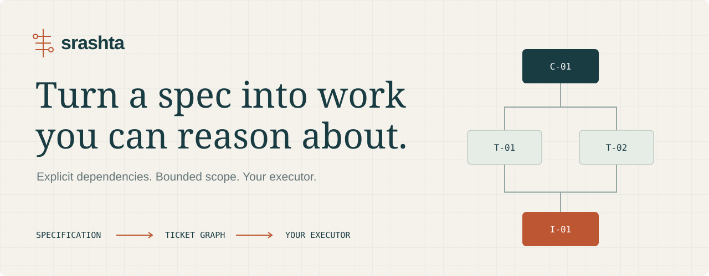
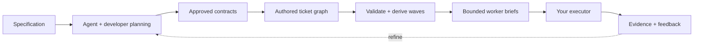

<p align="center">
  
</p>

<p align="center">
  <a href="https://github.com/nikitph/srashta/actions/workflows/tests.yml"></a>
  
  <a href="LICENSE"></a>
  
</p>

<p align="center">
  <a href="https://nikitph.github.io/srashta/">Explore the graph ↗</a> ·
  <a href="#get-started">Get started</a> ·
  <a href="GUIDE.md">Operating guide</a> ·
  <a href="examples/notes_demo.py">Working example</a>
</p>

Srashta turns specification-driven planning into an **explicit ticket graph**: requirements, shared contracts, dependencies, file ownership and acceptance criteria that a developer can inspect and an agent can work from.

The aim is practical: produce a better starting plan and reduce the effort spent correcting implementation. A graph can be useful long before its decomposition is perfect.

**Your planning agent authors the decomposition. Srashta checks its structure, derives execution waves and packages the work.** The Python CLI never calls a model. Execution stays with your chosen orchestrator.

## The useful part is the graph

A specification leaves many implementation decisions implicit. Which contract must be agreed first? Can these two tickets run together? Who owns the schema? What does each worker need to know? What would prove the feature is done?

Srashta gives those decisions a durable home, before they become scattered across code and conversations.



| In the graph | Why it matters |
| --- | --- |
| **Requirement ownership** | Trace work back to the behavior it is meant to deliver. |
| **Contract tickets** | Agree shared interfaces and structures before features depend on them. |
| **Dependency edges** | Make prerequisite work and execution order visible. |
| **File ownership** | Detect conflicting scopes before workers edit the same paths. |
| **Acceptance criteria** | Give each ticket a concrete definition of done. |
| **Open questions** | Keep unresolved decisions visible and propagate blockers. |
| **Focused context packs** | Give a worker its brief, relevant requirements and approved contract excerpts. |

Spec formats and planning guides can feed this layer. Worker systems can consume its output. The graph is the boundary between the two.

## Get started

Python **3.10+**, Git, macOS or Linux. Install from source; Srashta is not published on PyPI.

```bash
git clone https://github.com/nikitph/srashta.git
cd srashta
python3 -m venv .venv
source .venv/bin/activate
python -m pip install -e .

# Create a planning workspace; no PHP needed for this step.
srashta init my-api --dest ../my-api --stack none
cd ../my-api
srashta status
```

Edit `project.yaml`, write the specification, and follow the generated `PROCEDURE.md`. Project guides are exposed through `.agents/skills/` and `.claude/skills/`.

For a Laravel application, use `srashta init my-api --dest ../my-api --run-scaffold` instead. Scaffolding additionally needs PHP 8.3+ and Composer. The destination must be new or empty.

## From a plan to a handoff

Once the specification and project configuration are ready:

```bash
srashta run                       # Extract, lint, analyze and assign requirements

# Your planning agent writes contracts/phase-0.md. You review it.
srashta approve 0 --by YOUR_NAME

# Your planning agent writes tickets/phase-0.json.
srashta waves 0                    # Derive ordering from dependencies
srashta validate 0                 # Check the graph and approved inputs
srashta packs 0                    # Render one focused brief per ticket
srashta export 0                   # Produce the handoff bundle
```

Authored tickets live in **`tickets/`**. Derived graphs and handoffs live in **`build/`**. Deleting generated files does not delete the decomposition.

Commit the approved plan before execution. Your orchestrator handles claims, worker launches, sandboxing, review and merges. Srashta supplies eligible-ticket queries, worker inputs, verification and evidence records. Generic and Markdown Kanban exports are available; dedicated Multica or Symphony adapters are not included.

[Read the complete execution, closure and API-freeze workflow →](GUIDE.md)

## What is implemented today

- Requirement extraction, linting, module analysis and assignment.
- Authored ticket graphs, dependency waves and shared-resource ordering.
- Structural checks for ownership, contract references, blockers and artifact drift.
- Content-bound design approvals, focused briefs and export manifests.
- Ticket verification against a trusted Git base, execution events and phase closure.
- Laravel scaffolding, generated OpenAPI and API-freeze checks.

The decomposition itself is authored by a person or a planning agent using the supplied guides. **Reliable semantic spec → graph generation has not yet been benchmarked.** Structural validity cannot prove that a plan is a good interpretation of the product.

## A real, reproducible example

The [Notes API walkthrough](examples/notes_demo.py) builds a Laravel application and exercises the lifecycle through a frozen OpenAPI contract:

```bash
python -m pip install pytest jsonschema
python -m pytest -q

# Requires PHP 8.3+, Composer and Git; creates a new directory.
python examples/notes_demo.py /absolute/path/to/new-notes-demo
```

The local 0.1.2 verification recorded **142 Python tests passing** on Python 3.10 and 3.14, plus **five Laravel tests with 18 assertions**. The example checks create/read behavior, validation failures, persistence and generated API response types. An added route was also rejected after API freeze.

The example's implementation and approval identities are scripted fixtures. These checks demonstrate the workflow and enforcement; they are not a benchmark of autonomous planning or implementation. The local PHP 8.5 run emitted framework deprecation notices; the scaffolded CI targets PHP 8.3.

## Where this is going

The next question is how much a reviewed graph improves a real build: fewer missing dependencies, fewer context gaps, less integration repair and less total correction effort. Useful next work includes stronger decomposition guides, representative planning examples and thin adapters to existing executors.

Version 0.1 ends at backend/API freeze. A hosted scheduler, OS sandboxing, frontend delivery, MCP generation and deployment are outside the current release.

## Explore the project

| Resource | What you will find |
| --- | --- |
| [Interactive walkthrough](https://nikitph.github.io/srashta/) | An illustrative graph and the brief behind each ticket |
| [Operating guide](GUIDE.md) | Commands, source-of-truth rules, execution and migration |
| [Structural specification process](docs/design/structural-process/README.md) | Proposed behavioral contracts, Revision 2 review and Aarogya planning example; not yet implemented |
| [Decomposition guide](src/srashta/templates/skills/phase-decomposition.md) | The planning process supplied to your agent |
| [Ticket schema](src/srashta/templates/schemas/ticket.schema.json) | The structured handoff contract |
| [Changelog](CHANGELOG.md) | Release changes |
| [Contributing](CONTRIBUTING.md) | Development setup and useful failure reports |

---

**स्रष्टा · Srashta** — the one who brings into existence.

[MIT License](LICENSE) · Built by [Nikit Phadke](https://github.com/nikitph).
