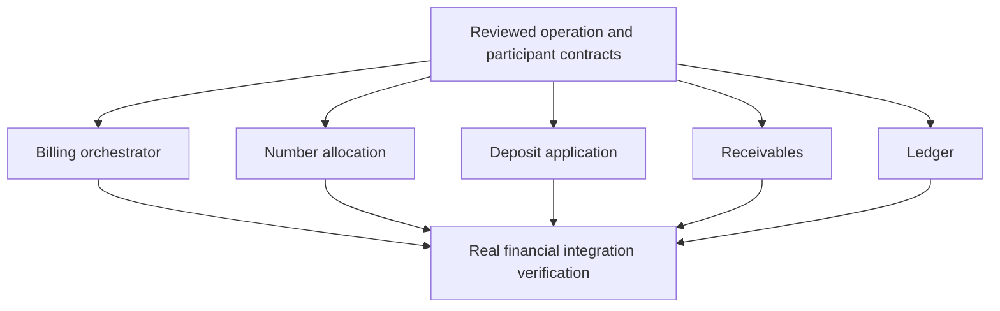

# Applying the structural rules to Aarogya

Date: 23 September 2026. Scope: a targeted review of the existing bill-finalization planning slice. This is not a full 39-check audit, complete set of registers, executed application test suite or new ticket graph.

Sources: [PRD](references/aarogya/source/aarogya-prd.md), [FinaliseBill brief](references/aarogya/briefs/T-14.md), [real integration brief](references/aarogya/briefs/I-01.md), [open decisions](references/aarogya/inputs/decisions.json). Rule interpretation follows [PROCESS.md](PROCESS.md).

## What the rules reveal

| Finding | Source and rule | Existing coverage | Required planning refinement |
|---|---|---|---|
| Financial atomicity spans several module owners, but the proposed implementation has one database commit. | FR-BIL-002, FR-PAY-003, FR-AR-001, FR-AR-004; R2, R17–R18 | C-03/C-04 and G-COMMIT already expose this decision. | Record the operation's commit boundary and participating actions. Preserve G-COMMIT as open. Do not add a saga merely to satisfy the source rule's “multi-owner” wording. |
| “Finalised bill cannot change” conflicts literally with later settlement/cancellation status transitions. | FR-BIL-002 versus Appendix B.7 and FR-BIL-007; R6–R7, R34 | C-03 proposes immutable financial content with separate metadata. | Confirm the exact immutable fields and permitted lifecycle/metadata changes. This is a scoped wording ambiguity, not proof the intended behaviors are incompatible. |
| Delivery retries have no complete recovery state machine in this slice. | FR-NOT-003; R8, R13–R16, R20 | C-01 provides accepted/rejected/outcome_unknown; G-DELIVERY exposes provider uncertainty. | Specify events in each delivery state, reconciliation timing, retry deadline, escalation, and handling of a late success after an unknown result. |
| Link expiry and OTP access need exact temporal behavior. | FR-NOT-004; R14–R16, R24–R25 | T-15/T-21 cover protected expiring links; PRD supplies document_link_valid_hours. | Set the issuance instant, equality-at-expiry behavior, resend/reissue policy and policy-version treatment. OTP expiry and attempt limits need explicit authority and values. Do not fabricate defaults. |
| Rounding correctness has no approved example oracle in the reviewed inputs. | NFR-002, FR-BIL-003–005; R25, R33 | G-MONEY already blocks the affected calculations. | Obtain exact examples for rounding ties, allocation, packages, discounts and deposits. Attach approved inputs/outputs to the responsible calculation tickets and integration verification. |
| Race expectations are narrated but not a complete matrix. | NFR-003, FR-BIL-002; R30 | T-14/I-01 name retries, stale revisions, series contention and rollback. | Enumerate identical-key retry, changed-payload retry, different-key same-encounter finalization, different bills sharing a series, and charge changes during finalization. Distinguish replay from conflict and allowed multiple successes. |

These findings deepen existing decisions rather than replacing them with new guessed answers. No old gate is closed by this review.

## Worked contract fragment: FinaliseBill

The following rows are proposed structural records, not approved domain decisions. IDs are namespaced to avoid collisions with existing source IDs such as MSG-008.

| ID | Proposed obligation | Trace / unresolved part | Bind to existing work |
|---|---|---|---|
| aarogya:OP-finalise | FinaliseBill orchestrates number, financial snapshot, deposits, receivables, ledger, audit and outbox using the same transaction context; remote delivery is outside it. | C-03/C-04; G-COMMIT open. | C-03/C-04 contract; T-14 orchestrator; T-13/T-16/T-17/T-18 participants; I-01 verification. |
| aarogya:INV-share-total | Patient share plus all payer shares equals the final total exactly in paise. | FR-BIL-003; rounding allocation G-MONEY open. | T-12/T-23 and I-01. |
| aarogya:INV-frozen-content | Committed bill lines, amounts and taxes cannot be overwritten; permitted metadata changes are separately named. | FR-BIL-002 and Appendix B.7; exact content/status interpretation open. | C-03, T-14/T-15/T-20 and I-01/I-02. |
| aarogya:SM-finalise | Billing executive with tenant/facility authority may finalise draft content only with no held charges, required recipient details, applicable policies and accepted source revisions. | FR-BIL-002, Appendix B.7, C-02/C-03; G-LATE open. | C-02/C-03, T-10/T-14 and I-01. |
| aarogya:CON-operation-replay | Same operation identity and same payload returns the prior result; conflicting payload produces an explicit conflict; ambiguous commit outcome is reconciled by identity. | C-01/C-03 proposed contract; operation identity scope and concurrent in-flight behavior still need binding. | T-03/T-14 and I-01. |
| aarogya:MSG-bill-finalised | BillFinalised is an immutable fact emitted from a committed snapshot. The patient-facing document message has its own release and supersession policy. | FR-NOT-003/004, MSG-008; G-DOCUMENT and G-DELIVERY open. | C-03/C-04, T-03/T-15/T-20/T-21 and I-02. |
| aarogya:TMR-delivery-recovery | An unresolved provider outcome has a stored next reconciliation time, bounded escalation policy, catch-up driver and health signal. | FR-NOT-003; proposed refinement of G-DELIVERY, duration/owner unresolved. | T-04/T-21 and I-02. |
| aarogya:EX-rounding | Approved fixture fixes inputs, exact tax and allocation outputs, policy versions and domain approval. | NFR-002, FR-BIL-003; G-MONEY open. No invented numerical answer. | T-11/T-12/T-23/T-24 and I-01. |

The financial operation should offer strong rollback for its participating local financial effects if G-COMMIT is accepted. An external send can instead be durably pending or outcome-unknown. Those are different observable guarantees and must not share a misleading “all or nothing” label.

## Acceptance cases to bind before implementation

These are test specifications only; none is claimed executed.

| Case | Protects | Action / expected evidence | Fault or mutation to detect |
|---|---|---|---|
| aarogya:TST-atomicity | OP-finalise | Fail each local participant before commit; no partial financial records, consumed number or deliverable outbox event remain. Retry can complete according to the operation contract. | Participant commits independently; outbox written outside transaction. |
| aarogya:TST-replay | CON-operation-replay | Submit identical keys concurrently and again after a lost response; one persisted financial outcome, allowed responses as specified. A changed payload conflicts. | Deduplication removed; operation key scoped incorrectly. |
| aarogya:TST-series | OP-finalise | Finalise different eligible bills concurrently in one numbering series; committed numbers remain unique and satisfy the accepted gap policy. Multiple successes are expected. | Counter update loses concurrency guard; number consumed on rollback. |
| aarogya:TST-source-race | SM-finalise | Change an authoritative charge revision during finalization; observe the approved stale-input outcome with no mixed snapshots. | Final revision check omitted. |
| aarogya:TST-immutability | INV-frozen-content | Attempt forbidden content writes through actions and direct database access where database enforcement is promised; exercise allowed status/metadata updates separately. | Constraint/privilege removed or action permits financial overwrite. |
| aarogya:TST-unknown-send | MSG-bill-finalised, TMR-delivery-recovery | Provider accepts but its response is lost; recovery reconciles by stable identity before any permitted resend. A fake proves local handling; provider evidence is separately required. | Unknown treated as rejection and blindly retried. |
| aarogya:TST-time | TMR-delivery-recovery | Advance the injected clock before/at/after the chosen deadline, skip scheduler runs and replay a run; observe declared recovery, catch-up and no repeated domain effect. | Backstop missing; query processes only today's records. |
| aarogya:TST-calculation | INV-share-total, EX-rounding | Run approved exact examples and allocation conservation properties against snapshotted policy versions. | Live policy substituted; tie handling changed; remainder assigned incorrectly. |

Domain owner approval is required for financial outcomes, not for inventing a passing fixture. No test here decides G-MONEY or G-TAX by itself.

## Graph effect

Keep the original trial intact as the comparison baseline. Most of this refinement attaches structural obligations and acceptance cases to its existing 26 work units. It does not yet justify a new count or a claim of fewer dependencies.

For the financial slice, the intended dependency pattern remains:

This is a partial view: foundation and input-provider prerequisites remain in the actual graph. “Reviewed” is a required state, not a claim that the current contracts are approved. Contract fakes can enable isolated implementation; they cannot satisfy the verification join.

The improvement to measure is whether these records remove guesses from worker briefs and expose missing prerequisites before implementation. Structural checks and actual execution should then be evaluated separately.
